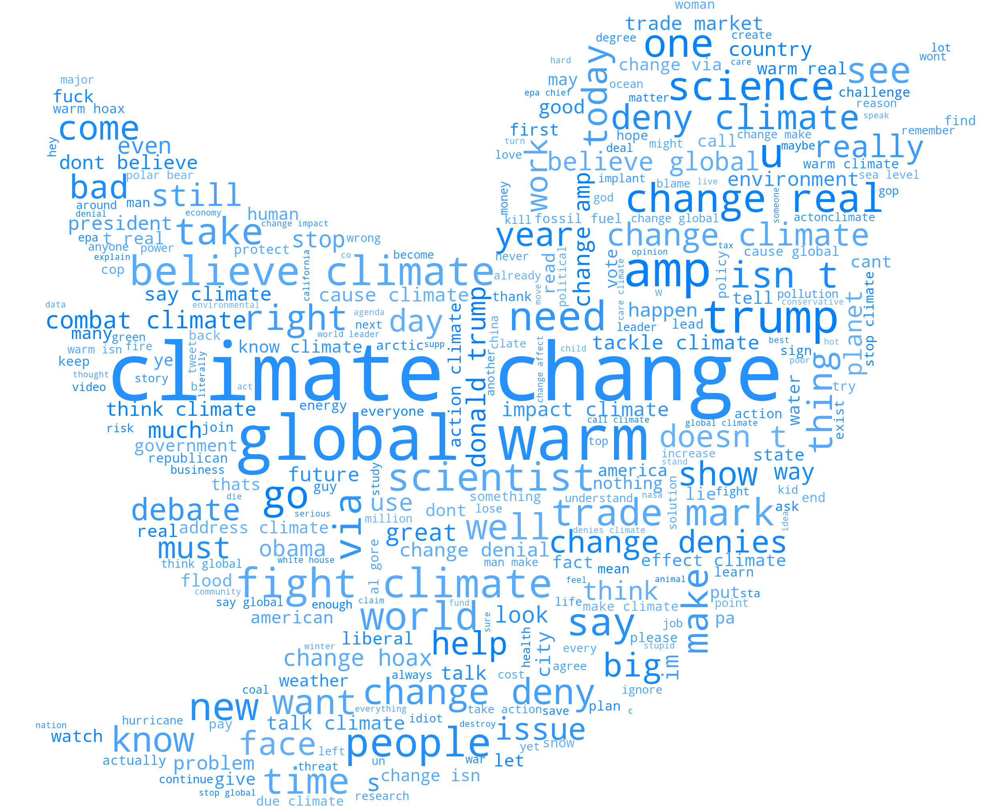

# Sentiment Analysis For Climate Change

Our planet is warming up due to the emission of greenhouse gases into the biosphere, thus leading to climate change.
This study uses Sentiment Analysis to study people's attitudes toward this socially relevant topic. This study therefore will test several data mining models over a pre-labeled dataset containing a plethora of tweets regarding global warming in order to find the best one.

You can find the PowerPoint presentation for this work here: [Sentiment_Analysis.pdf](./Sentiment_Analysis.pdf)

The study has been conducted in several steps, each of them documented in a related notebook:
- [Preprocessing](./sentiment_analysis_preprocessing.ipynb): Text data in general (and on Twitter even more) are noisy. This noise, if not handled properly, will lead to low performance for our models. Here we will clean and tokenize our data in the best possible way to achieve better results.
- [Data Analysis](./sentiment_analysis_dataanalysis.ipynb): Once we preprocessed our data, we want to get an idea of how our data is done. We will plot Wordclouds, class distributions and boxplots in order to extract relevant information.
  
- [Classification 1](./sentiment_analysis_classification.ipynb): In this notebook we will try some basic data mining models (Naive Bayes Classifier, SVMs, Logistic Regression) with different text representations: Bag Of Words, TF-IDF, Word Embeddings.
- [Training with Neural Networks](./Training_NN.py): In this file, we will train a simple feedforward neural network by tuning properly the hyperparameters over a validation set.
- [Finetuning BERT](./BERT_finetune.py): Bidirectional Encoder Representations from Transformers (BERT) is a family of language models introduced in 2018 by researchers at Google. It is a Transformer architecture that is nowadays often used as Baseline for NLP tasks. In this study, we finetune DistilBERT, a faster and smaller version of BERT.
